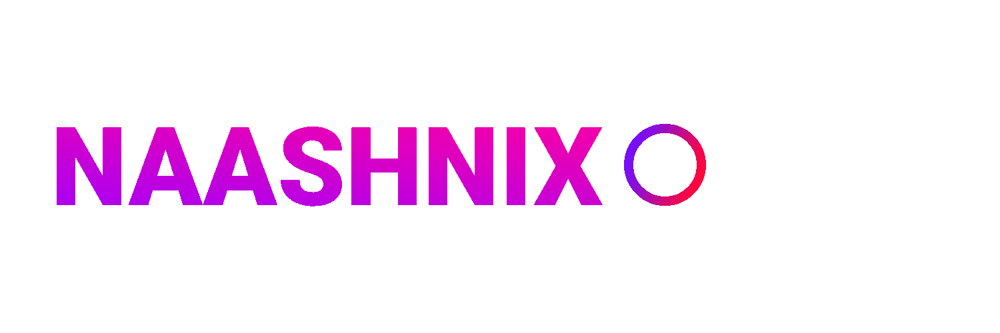

# **Hey! I'm Ravindu Thilakshana**    

 ### I’m Full Stack developer and still undergraduate. my passion for software lies with dreaming up ideas and making them come true with elegant interfaces. I take great care in the experience, architecture, and code quality of the things I build. 
 

<section style="display:flex;">

 
 
I’m looking for challenging problems to solve. My background is in enterprise software development, however, I have an insatiable curiosity for AI – particularly deep learning – applications and their potential to change the technology landscape. 

</section>

# ***Languages And Tools***

